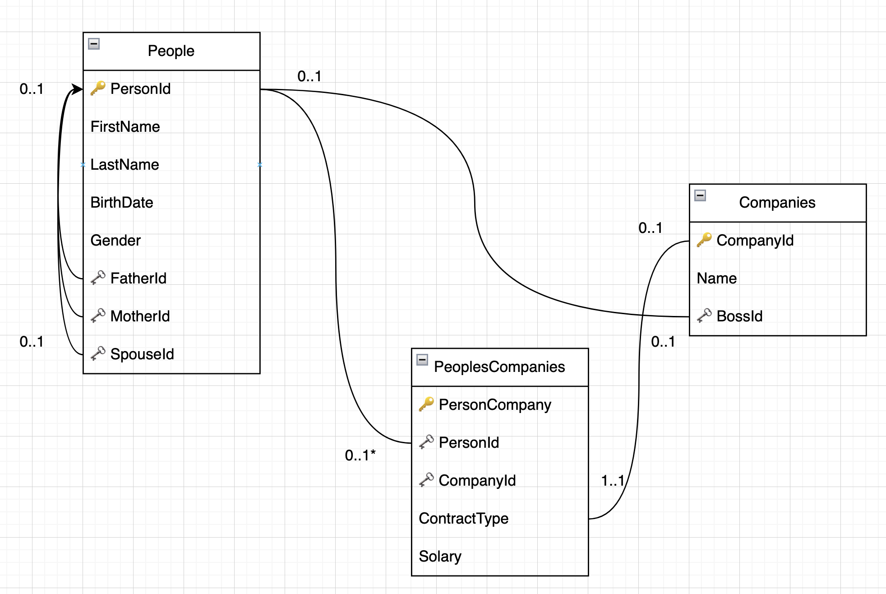
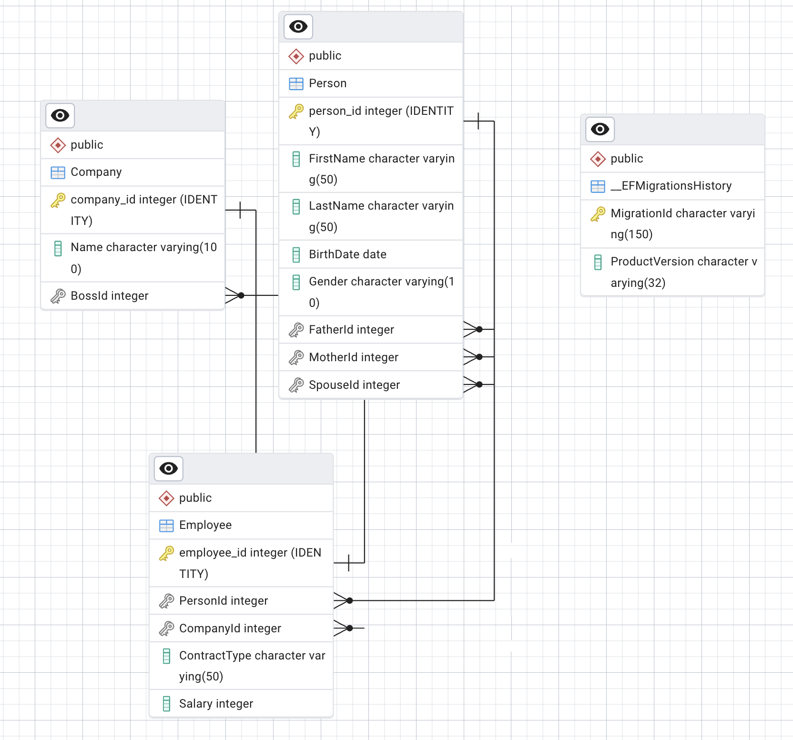
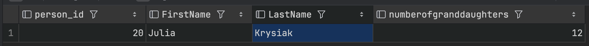
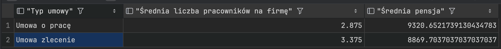

# Ogólny opis

Zawartość repozytorium:
- **DatabaseInitializer** - aplikacja konsolowa .NET 9.0, która inicjalizuje bazę danych PostgreSQL z przykładowymi danymi.
- **Zrzut bazy danych/postgres-db-copy.sql** - zrzut bazy danych PostgreSQL z przykładowymi danymi.

### Diagram ERD


### Diagram ERD programu PgAdmin


### Indeksowane kolumny
- Tabela Person
  - Gender
  - FirstName, LastName - indeks złożony
  - BirthDate
- Tabela Employee
  - Salary
  - ContractType
  - CompanyId, ContractType - indeks złożony
- Tabela Company
  - Name
## Zadania

A.

```sql
SELECT
    Grandparent.person_id,
    Grandparent."FirstName",
    Grandparent."LastName",
    COUNT(DISTINCT Grandchild.person_id) AS NumberOfGranddaughters
FROM "Person" AS Grandparent
         JOIN "Person" AS Parent ON (Grandparent.person_id = Parent."FatherId" OR Grandparent.person_id = Parent."MotherId")
         JOIN "Person" AS Grandchild ON (Parent.person_id = Grandchild."FatherId" OR Parent.person_id = Grandchild."MotherId")
WHERE Grandchild."Gender" = 'Female'
GROUP BY Grandparent.person_id, Grandparent."FirstName", Grandparent."LastName"
ORDER BY NumberOfGranddaughters DESC
LIMIT 1;
```

Wynik zapytania:


B.

```sql
SELECT
    e."ContractType" AS "Typ umowy",
    COUNT(e.employee_id)::DECIMAL / COUNT(DISTINCT e."CompanyId") AS "Średnia liczba pracowników na firmę",
    AVG(e."Salary") AS "Średnia pensja"
FROM "Employee" e
GROUP BY e."ContractType"
ORDER BY e."ContractType";
```

Wynik zapytania:


C. -